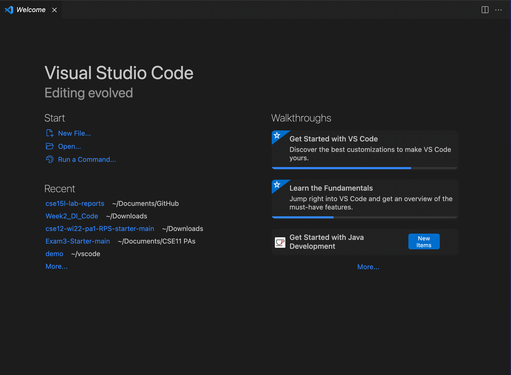
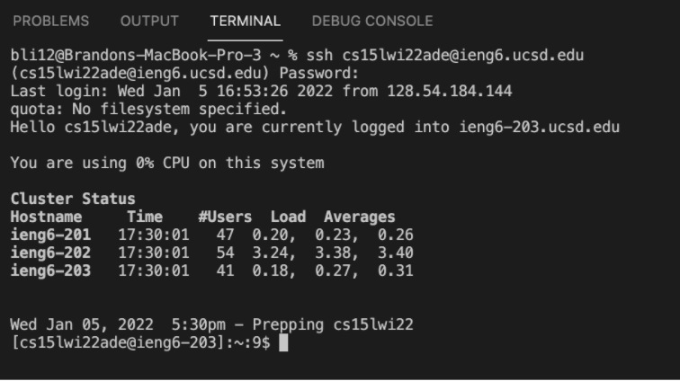
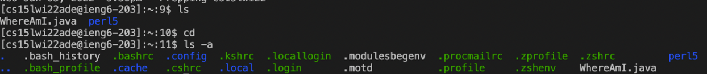
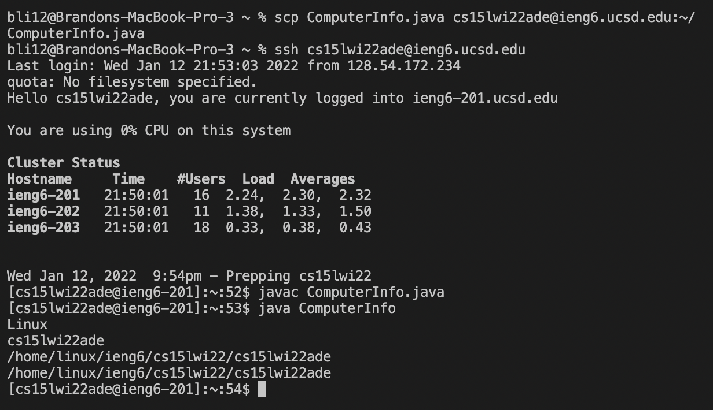
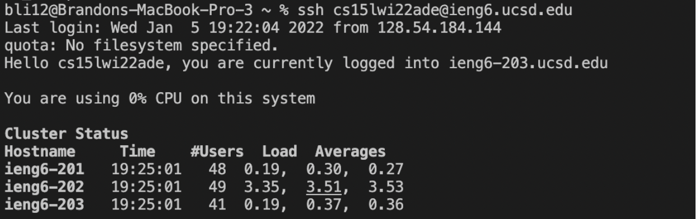
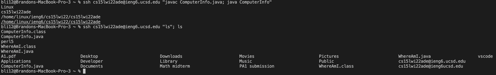

# ieng6 Login Tutorial

**1. Installing VSCode**

* Install VSCode for your system from the [website](https://code.visualstudio.com/).
* Once you open the application, you should see a similar screen as the one in the screenshot below.



**2. Remotely Connecting**

* If you're on Windows, install [OpenSSH](https://docs.microsoft.com/en-us/windows-server/administration/openssh/openssh_install_firstuse) to allow connection from your local computer to another computer. Then, look up your [CS15L account](https://sdacs.ucsd.edu/~icc/index.php).
* Open a new terminal in VSCode and type in the following command (`id` is replaced by your unique 3 letters):
```
$ ssh cs15lwi22<id>@ieng6.ucsd.edu
```
* Answer `yes` to the following message and enter your UCSD account password. If a similar screen appears, your computer is now a  `client` connected to the CSE Lab's computer, or the `server`:

* If you want to log off the server, type `exit` or `logout`.

**3. Trying Some Commands**
* Here is a [list](https://files.fosswire.com/2007/08/fwunixref.pdf) of commands you can run on your local computer or on the remote.
* To start, try `ls` to list the files in your directory. You can also print your current directory by running `pwd` or change into the home directory with `cd`. For instance:


**4. Moving Files with `scp`**
* Exit the remote computer and create a new java file in VSCode called `ComputerInfo.java`. Compile the code with `javac` and run it with `java`. Pay attention to what this outputs:
```
class ComputerInfo{
    public static void main(String[] args){
        System.out.println(System.getProperty("os.name"));
        System.out.println(System.getProperty("user.name"));
        System.out.println(System.getProperty("user.home"));
        System.out.println(System.getProperty("user.dir"));
}
```
* Now, type the following command, with `id` replaced by your 3 unique letters. Don't forget the `:~/` at the end!
```
scp ComputerInfo.java cs15lwi22<id>@ieng6.ucsd.edu:~/
```
* After typing your password and logging back into the remote computer, run `ls` to see if `ComputerInfo.java` has been successfully copied. Compile and run the code with the commands you used on your local computer. A similar output should appear:


* **NOTICE**: Unlike my screen, you will be prompted with a required password entry after using SCP and SSH. We will learn how to alleviate this inconvenience in the next step.

**5. Setting an SSH Key**
* To replace your password, we will create `ssh` keys with the command `ssh-keygen`, generating a public key, copied to the remote computer, and a private key, stored on your local computer along with the public. Below, follow these commands. **NOTICE**: Windows users will also have to follow extra [steps](https://docs.microsoft.com/en-us/windows-server/administration/openssh/openssh_keymanagement#user-key-generation) to generate keys.
*  `username`, in the directions below, should also be replaced by your local computer username.
```
$ ssh-keygen
Generating public/private rsa key pair.
Enter file in which to save the key (/Users/username/.ssh/id_rsa): /Users/username/.ssh/id_rsa
Enter passphrase (empty for no passphrase): (press enter/return)
Enter same passphrase again: (press enter/return again)
Your identification has been saved in /Users/username/.ssh/id_rsa.
Your public key has been saved in /Users/username/.ssh/id_rsa.pub.
The key fingerprint is:
SHA256:jZaZH6fI8E2I1D35hnvGeBePQ4ELOf2Ge+G0XknoXp0 username@your-device
The key's randomart image is:
+---[RSA 3072]----+
|                 |
|       . . + .   |
|      . . B o .  |
|     . . B * +.. |
|      o S = *.B. |
|       = = O.*.*+|
|        + * *.BE+|
|           +.+.o |
|             ..  |
+----[SHA256]-----+
```
* Above, `/Users/username/.ssh/id_rsa.` is the location of the private key on your computer and `/Users/username/.ssh/id_rsa.pub.` is the location of the public key.
* For the final step, we can make an `.ssh` directory on the remote computer, copying the public key into it. Then, you will no longer be prompted for a password after an `ssh` command.
```
$ ssh cs15lwi22zz@ieng6.ucsd.edu
$ <password>
$ mkdir .ssh
$ <exit>
$ scp /Users/username/.ssh/id_rsa.pub cs15lwi22<id>@ieng6.ucsd.edu:~/.ssh/authorized_keys
```
* `ssh` output should now be:



**6. Optimizing Remote Running**
* To faciliate the process of running commands, we can use different "shortcuts" and run multiple lines at once. For example:
```
ssh cs15lwi22<id>@ieng6.ucsd.edu "javac ComputerInfo.java; java ComputerInfo" 
```
* The quotes above encaptulate the two commands and run both on the server. Without the quotes, java will run on the client instead, because the semi colon separates the commands.
* Another example is `cd` as shown below. This runs the command on the server and exits automatically afterwards.
```
ssh cs15lwi22<id>@ieng6.ucsd.edu "cd"
```
* The example below demonstrates if a command lies outside of quotations marks. First, `ls` is run on the server, then the user is logged out and the second `ls` is run on the client's computer:
```
ssh cs15lwi22<id>@ieng6.ucsd.edu "ls"; ls
```



* Overall, this will reduce the amount of keystrokes and mouse clicks significantly, each time you login/run commands on the server. For the example above (compiling and running ComputerInfo.java on the server), when typing the commands on seperate lines, I use 3 more keystrokes, and it takes me about 5 seconds longer to run everything.
