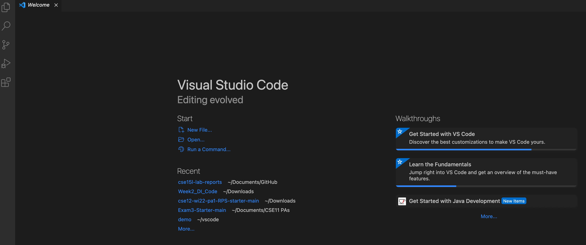
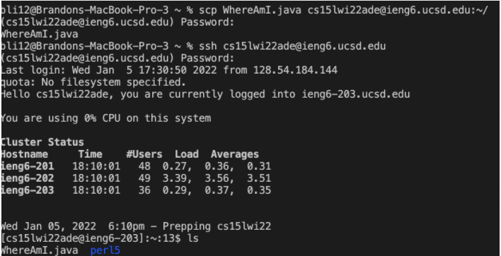

# ieng6 Login Tutorial

**1. Installing VSCode**

* Install VSCode for your system from the [website](https://code.visualstudio.com/).
* Once you open the application, you should see a similar screen as the one in the screenshot below.



**2. Remotely Connecting**

* If you're on Windows, install [OpenSSH](https://docs.microsoft.com/en-us/windows-server/administration/openssh/openssh_install_firstuse) to allow connection from your local computer to another computer. Then, look up your [CS15L account](https://sdacs.ucsd.edu/~icc/index.php).
* Open a new terminal in VSCode and type in the following command (`id` is replaced by your unique 3 letters):
```
$ ssh cs15lwi22<id>@ieng6.ucsd.edu
```
* Answer `yes` to the following message and enter your UCSD account password. If a similar screen appears, your computer is now a  `client` connected to the CSE Lab's computer, or the `server`:

* If you want to log off the server, type `exit` or `logoff`.

**3. Trying Some Commands**
* Here is a [list](https://files.fosswire.com/2007/08/fwunixref.pdf) of commands you can run on your local computer or on the remote.
* To start, try `ls` to list the files in your current working directory. You can also list directories by running `pwd` or change into the home directory with `cd`. For instance:


**4. Moving Files with `scp`**
* Exit the remote computer and create a new java file in VSCode called `ComputerInfo.java`. Compile the code with `javac` and run it with `java`. Pay attention to what this outputs:
```
class ComputerInfo{
    public static void main(String[] args){
        System.out.println("System.out.getPropery("os.name"));
        System.out.println("System.out.getPropery("user.name"));
        System.out.println("System.out.getPropery("user.home"));
        System.out.println("System.out.getPropery("user.directory"));
}
```
* Now, type the following command, again with `id` replaced by 3 unique letters. Don't forget the `:~/` at the end!
```
scp ComputerInfo.java cs15lwi22<id>@ieng6.ucsd.edu:~/
```
* After typing the password and logging back into the remote computer, run `ls` to see if `ComputerInfo.java` has been successfully copied. Compile and run the code with the commands you used on your local computer. A different output should appear:
