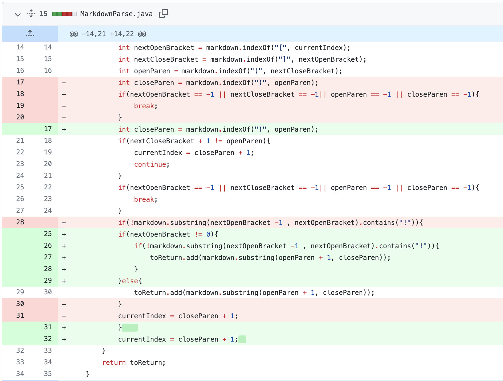

# Lab Report 2

**Bug 1**
* The first bug we resolved was if there was text inbetween the ```]``` and ```(```. This is shown below:


* This [link](https://github.com/bcli12/markdown-parse/blob/main/text-inbetween.md) is the file that originally produced a failure-inducing input. The symptom of this input is shown below (before addressing it):


* As shown in the screenshot, if there's text inbetwen the close bracket and open parentheses, the string should not be considered a link. When we don't account for this bug, the character after ```nextCloseBracket``` not being ```openParen```, ```notalink.com``` appears in the array list as a link, which is the symptom of the failure-inducing input.

**Bug 2**
* The second bug we resolved was if there was an image link in the file:


* This [link](https://github.com/bcli12/markdown-parse/blob/main/image-file.md) is the image test file. The symptom of this input is shown below (before addressing it):


* The screenshot above shows that ucsd.png was added, which is the symptom of the bug. Without an if statement checking whether there is a ```!``` before the open bracket, image links will be added to the array list as well, as demonstrated by the failure inducing input.

**Bug 3**
* In lab four, a bug resolved was if there is a ```nextOpenBracket``` at index 0. Shown below:



* This [link](https://github.com/bcli12/markdown-parse/blob/main/empty-link.md) is a file with an empty link; the file specifically contains ```[]()``` but is shown as an empty markdown file in github. The symptom of the input is shown below:


* Our group's original test for potential image links checks the character before ```nextOpenBracket```. If ```nextOpenBracket``` is at index 0 (the bug), however, a ```IndexOutOfBoundsException``` would be thrown as a result, which is the symptom of the failure inducing input.