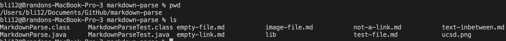
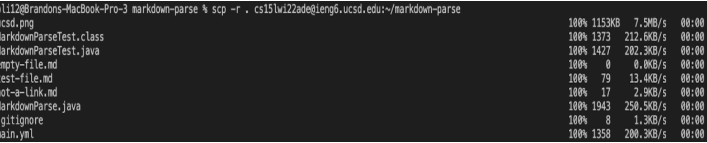
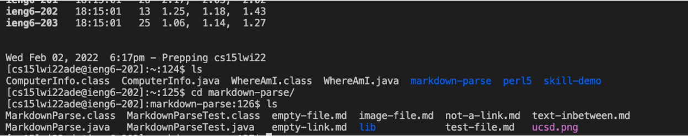

# Lab Report 3

For this weeks report, I will discuss copying whole directories with ```scp-r```.

It's a inconvenience to copy every file in a directory from the client's computer to the server. Instead of doing multiple ```scp``` commands manually, ```scp-r``` does this for us and recursively calls ```scp```, copying all the corresponding files into a new directory on the server.

In the lab, we copied the markdown-parse directory onto the ```ieng6``` server. Below is a screen shot of the directory in my local computer:



Then, I run the command:

```
scp -r . cs15lwi22ade@ieng6.ucsd.edu:~/markdown-parse
```

And the current directory, which is the purpose of the ```.``` in the command, is copied onto a new directory called markdown-parse in the server:



After logging in and running ```ls```:



Output after I run the tests on ```ieng6```:
