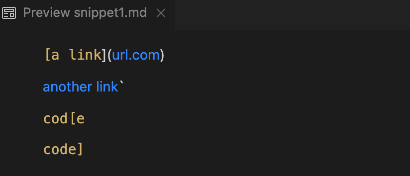
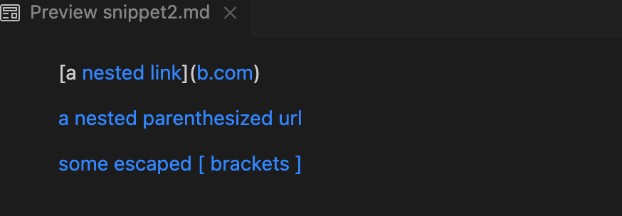
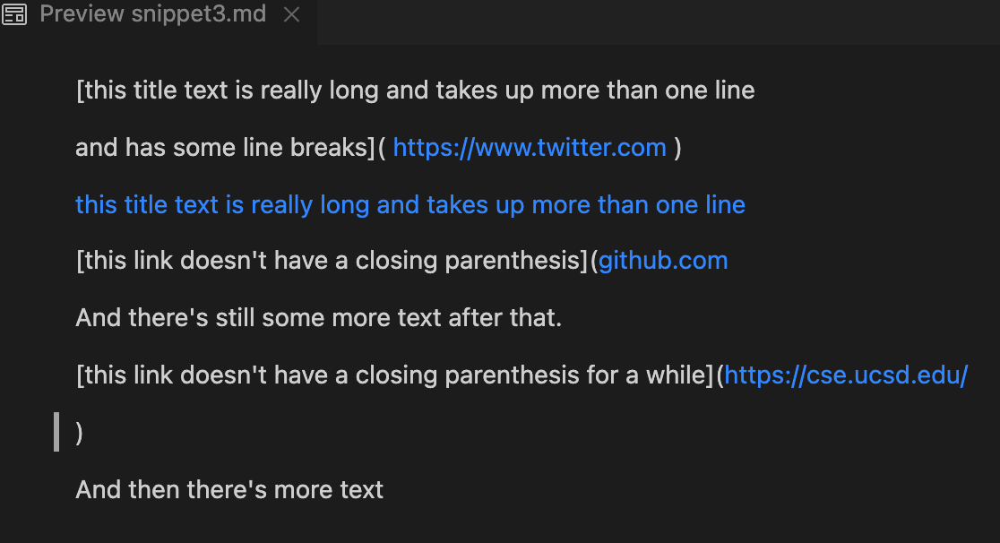
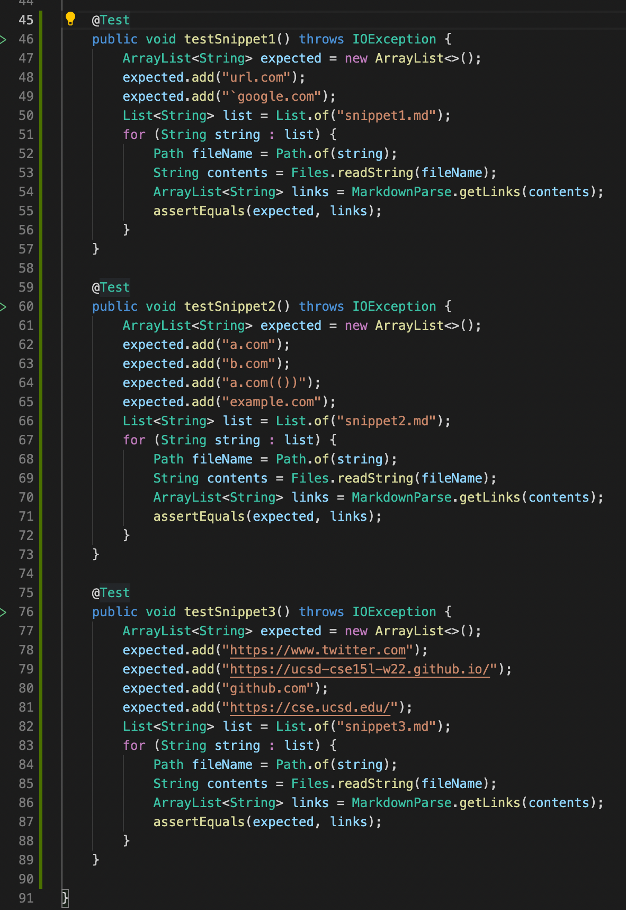
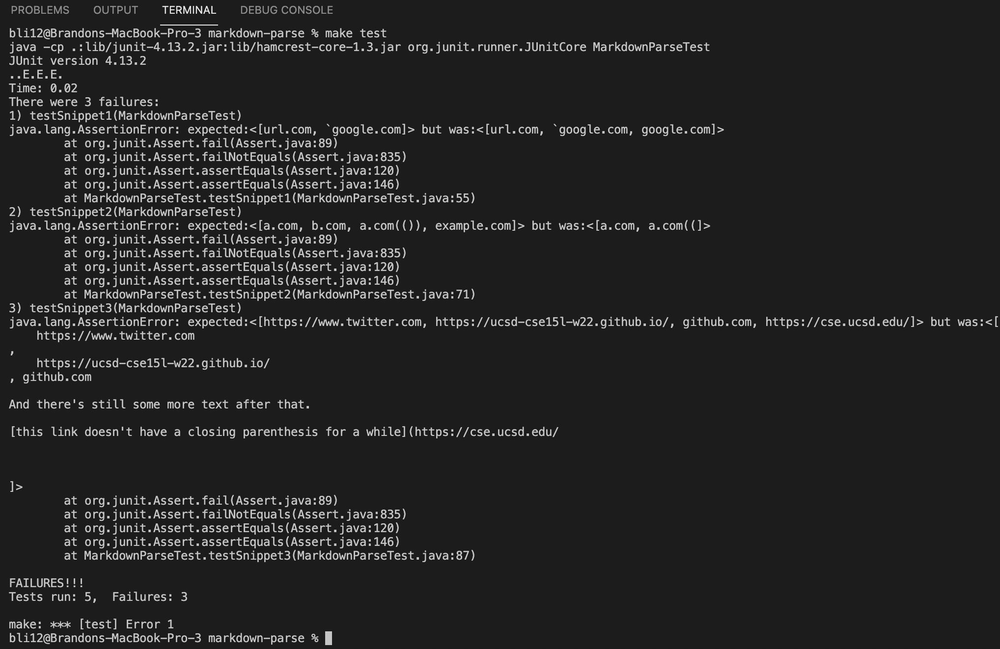
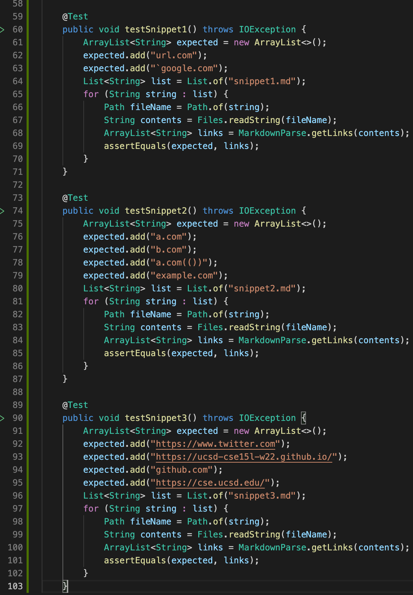
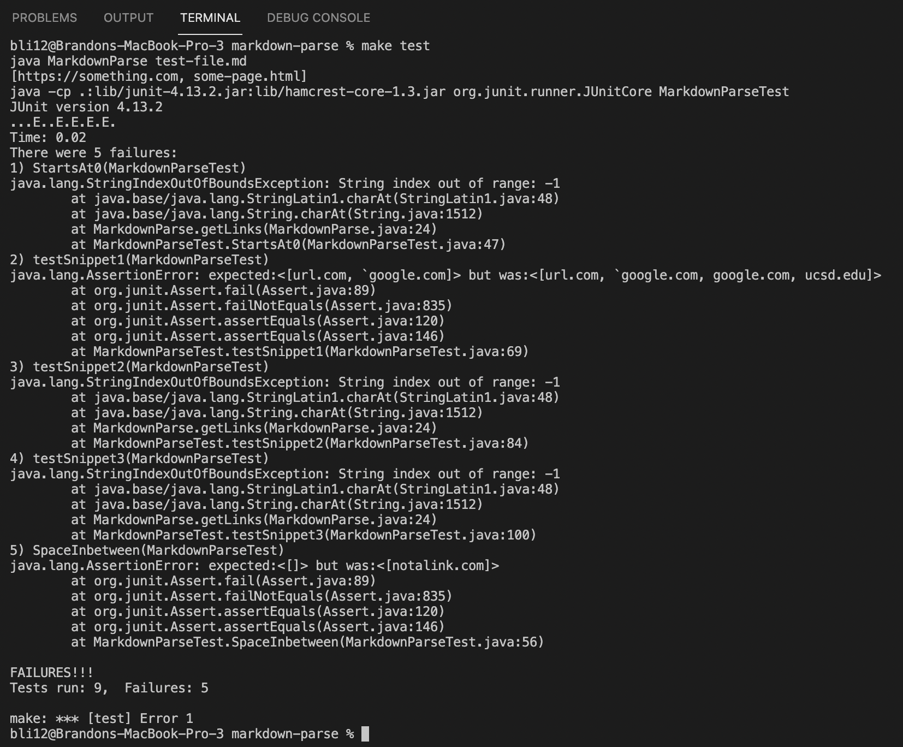
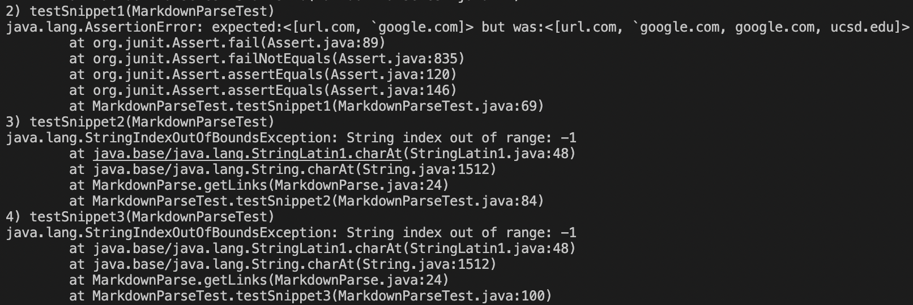

# Lab Report 4
I'll first discuss the expected output for the three snippets based on VScode preview:

## Snippet 1



* As shown in the preview, ```url.com``` and ```another link``` are both links, so ```url.com``` and ``` `google.com``` should be added to the expected ArrayList.

## Snippet 2



* As shown in the preview, ```nested link```, ```b.com```, ```a nested parenthesized url```, and\
 ``` some escaped [ brackets ] ``` are all links, so ```a.com```, ```b.com```, ```a.com(())```, and ```example.com``` should be added to the expected ArrayList.

## Snippet 3



As shown in the preview, ```https://www.twitter.com```,\
 ```this title text is really long and takes up more than one line```, ```github.com```, and ```https://cse.ucsd.edu/``` are all links, so ```https://www.twitter.com```,\
  ```https://ucsd-cse15l-w22.github.io/```, ```github.com```, and ```https://cse.ucsd.edu/``` should be added to the expected ArrayList.

Next, I'll show testing the three snippets on our markdown-parse [repository](https://github.com/bcli12/markdown-parse).

Here are the tests in my MarkdownParseTest.java file:



Here is the corresponding output (the snippet tests are the only failures that appear):



Now, I'll show testing the three snippets on the reviewed markdown-parse 
[repository](https://github.com/TheZenMasterz/markdown-parse)


Here are the tests in the MarkdownParseTest.java file we reviewed (same tests as in my repo):



Here is the corresponding output:



And here is the specific part of the JUnit output that shows the snippet test failures:



## Snippet 1 Code Change
* I think there is a small code change that can make the program work for inline code with backticks. You'd have to do several checks with if statements to see if a link is inside a code block or if there are backticks inside the ```()``` and ```[]```, for instance. 

## Snippet 2 Code Change
*  I don't think there's a small code change you can do to account for nested parentheses, brackets, and escaped brackets. We could make a structural change, and instead of reading the entire file, only read an individual line and check for all links within it. Overall, it's then easier to account for cases like nested links since we only need to consider one line at a time.

## Snippet 3 Code Change
*  I think a small code change is viable here. For my output, the extra space is added to the ArrayList, which can be resolved with the string method ```trim()```, and an if statement that checks for ```\n``` can account for the line breaks.

