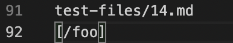

# Lab Report 5

1. I found the tests with different results by using the command\
 ```diff mymarkdownparse-week9/results.txt  markdownparse-week9/results.txt```. ```mymarkdownparse-week9``` is a directory with my implementation of ```MarkdownParse.java``` and ```markdownparse-week9``` is a directory that contains the provided implementation. The ```results.txt``` file in each directory contains the corresponding result of running the same ```script.sh``` on one version of MarkdownParse, which called the ```getLinks(String markdown)``` method, with every file in ```test-files/``` being passed in as an argument (after ```Files.readString(fileName)``` is called). I used output redirection with the command ```bash script.sh > results.txt``` to get the output into a file called ```results.txt``` for both directories. The screenshot below shows the some of the result of using ```diff```:

 

 2. I'll now explain the first test I chose:

 * The first test was on line 92 of ```results.txt```. Here is a screenshot of my own and then the provided implementation's outputs after using ```diff```:

 

 * The corresponding test was ```14.md```:

 

 * Here is the contents of ```14.md``` and a VSCode preview of the file:

 

 

 * As shown by the preview in VSCode, ```/foo``` is not a link and should not be added to the returned ArrayList. Thus, the provided implementation is incorrect. Moreover, the bug in the implementation is that it does not check for the character before ```nextOpenBracket```. In this test, it adds the substring inbetween the parens despite a ```\``` character being before the ```[```. I'll now show a screenshot where the code should be fixed:

 

 * To fix the code, another if statement should be placed after the first if statement, which checks that ```[```, ```]```, ```(```, ```)``` all exists, in the screenshot. This if statement should check that ```nextOpenBracket``` is not equal to ```0```, and the character at index ```nextOpenBracket - 1``` is not ```\```. If there is a ```\``` before ```nextOpenBracket```, then we can set ```currentIndex = closeParen + 1``` and move onto the next possible link in the file.

 3. I'll now explain the second test I chose

 * The second test was on line 230 of ```results.txt```. Here is a screenshot of my own and then the provided implementation's outputs after using ```diff```:

 

 * The corresponding test was ```201.md```:

 

 * Here is the contents of ```201.md``` and the VSCode preview of the file:

 

 

 * As shown in the VSCode preview, ```baz``` is not a link, so it should not be added to the returned ArrayList. Thus, the provided implementation is incorrect. Moreover, the bug in the implementation is that it does not check if there are characters inbetween ```nextCloseBracket``` and ```nextOpenParen```. In this test, it adds the substring inbetween ```(``` and ```)``` despite ```: <bar>``` being inbetween the ```]``` and ```(```. I'll now show a screenshot of where the code should be fixed:

 

 * To fix the code, another if statement should be placed after the first if statement, which checks that ```[```, ```]```, ```(```, ```)``` all exists, in the screenshot. This if statement should check that ```nextOpenParen - 1 = nextCloseBracket```. If this is not true, then once again, we can set ```currentIndex = closeParen + 1``` and move onto the next possible link in the file.